# 🗺️ Onboarding Flowcharts - Visual Guide

**Projekt:** Sparkfined PWA  
**Version:** 2.0  
**Datum:** 2025-11-04

---

## 📋 Übersicht

Dieser Dokument enthält Mermaid-Flowcharts für alle Onboarding-Flows.

---

## 🎯 Flow 1: First-Time User Journey (Complete)

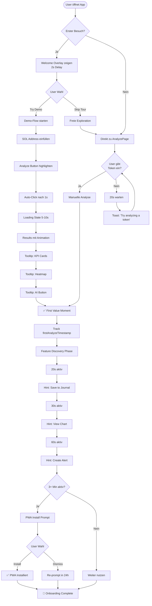

---

## 🔄 Flow 2: Demo Analysis (Detailed)

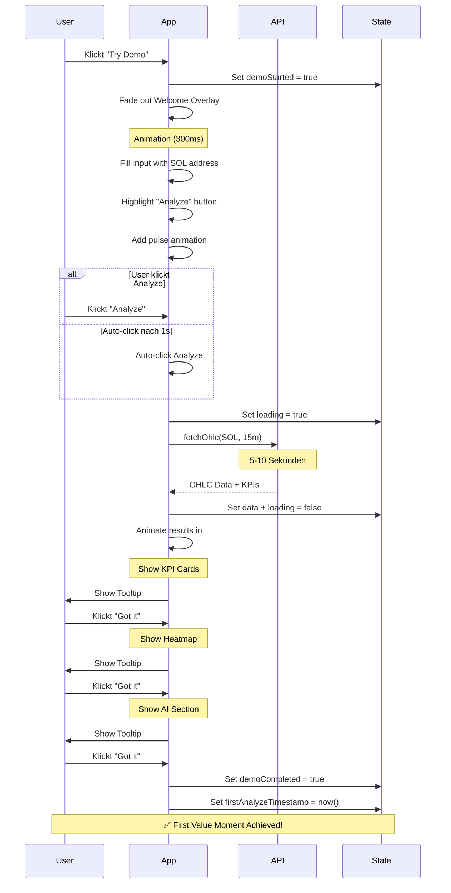

---

## 🎫 Flow 3: Access System Discovery

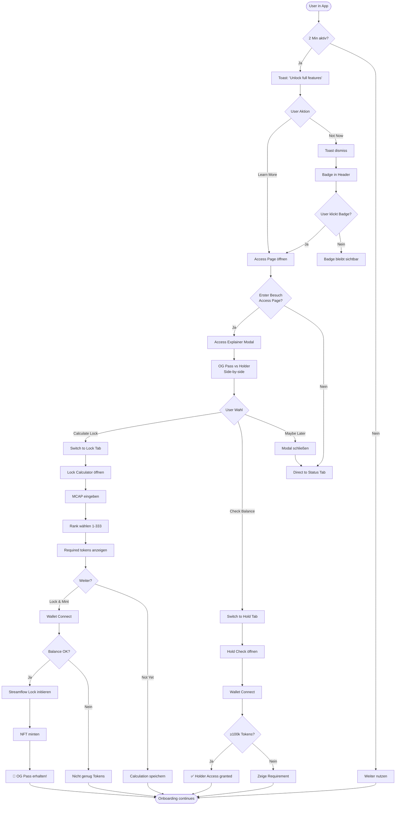

---

## 📲 Flow 4: PWA Installation Flow

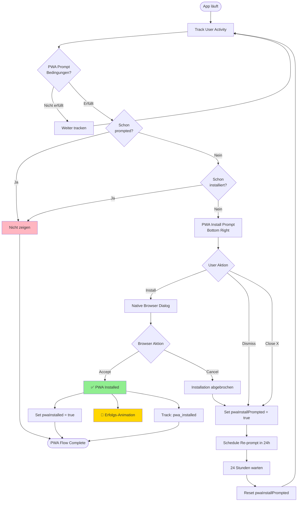

---

## 📝 Flow 5: Journal Integration Flow

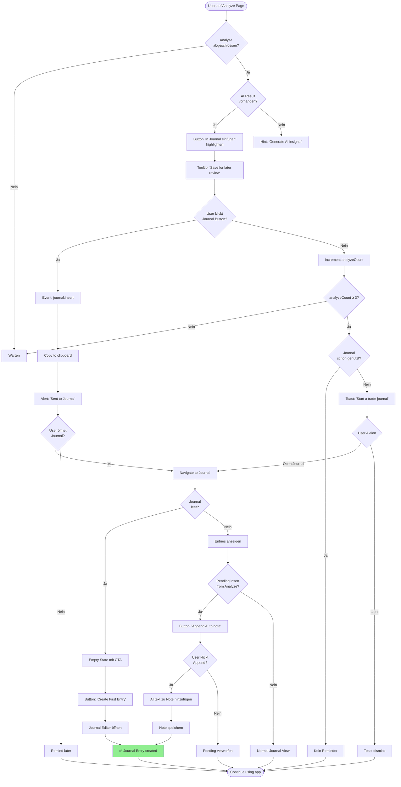

---

## 🔔 Flow 6: Push Notification Opt-In

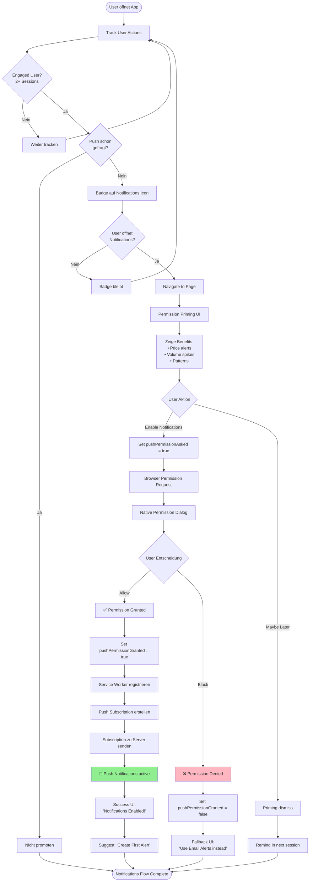

---

## 🎯 Flow 7: Feature Discovery (Bottom Nav)

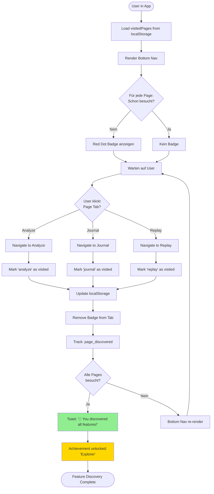

---

## 📊 Flow 8: Analytics Tracking

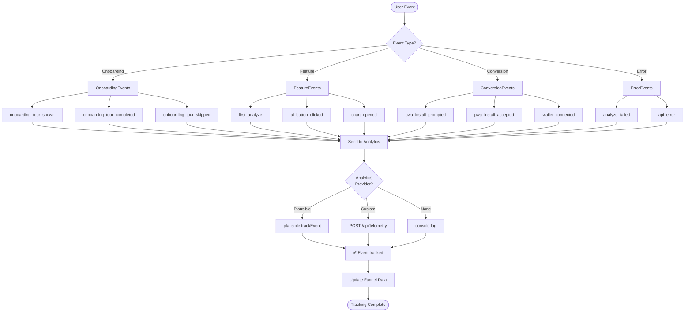

---

## 🔄 Flow 9: Onboarding State Lifecycle

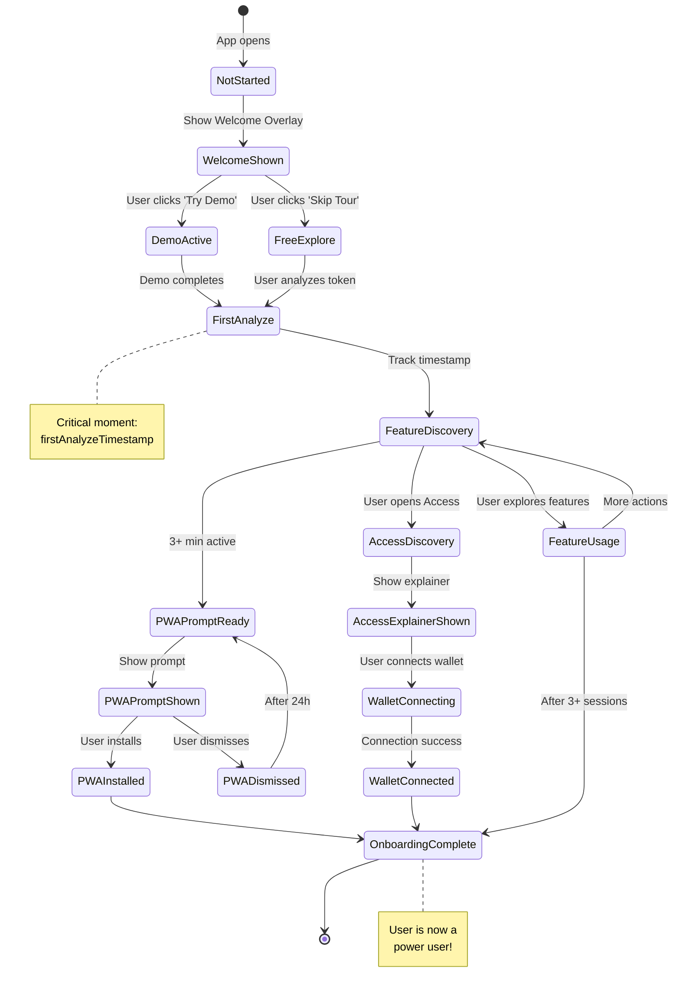

---

## 🎬 Flow 10: Complete User Journey (High-Level)

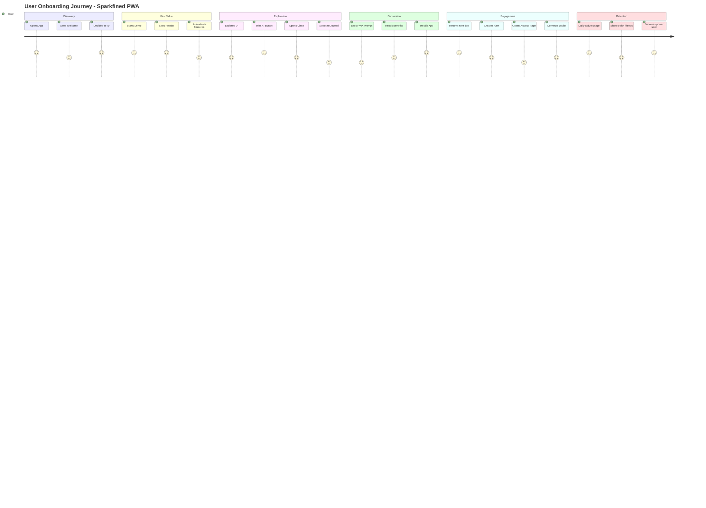

---

## 📈 Funnel Visualization

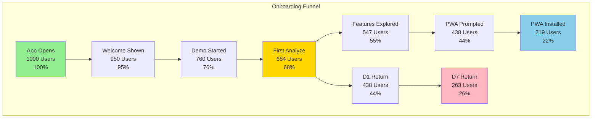

---

## 🎯 Zusammenfassung

Diese Flowcharts zeigen:

1. ✅ **Complete User Journey** - Vom ersten Öffnen bis Power User
2. ✅ **Feature Discovery** - Wie User Features entdecken
3. ✅ **Conversion Flows** - PWA Install, Wallet Connect
4. ✅ **State Management** - Wie Onboarding-State sich entwickelt
5. ✅ **Analytics** - Was getrackt wird
6. ✅ **Funnel** - Wo User abspringen

**Nächste Schritte:**
- Feedback zu den Flows
- Anpassungen basierend auf Diskussion
- Implementation der Priority-Flows

---

**Fragen oder Feedback? Lass uns diskutieren! 💬**
