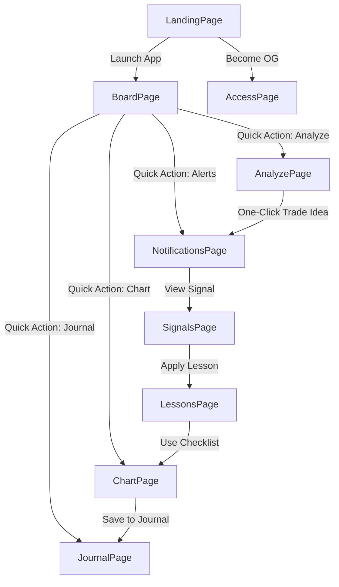

# User Flows: New Pages (HomePage, BoardPage, SignalsPage, LessonsPage, LandingPage)

**Document:** Step-by-step user workflows for 5 new pages  
**Date:** 2025-11-09  
**Status:** ✅ Complete

---

## Flow 8: HomePage — Beta Shell Theme Toggle

**TL;DR:** User lands on simple beta shell, toggles theme, sees feature checklist

### User Journey Steps

```
1. USER LANDS ON HOMEPAGE (/)
   ├─ Page loads (min-h-screen flex centered)
   ├─ Default state: Dark mode
   └─ Displays: Logo, title, subtitle, button, checklist

2. USER READS CONTENT
   ├─ Title: "Sparkfined TA-PWA Beta Shell"
   ├─ Subtitle: "Technical Analysis Progressive Web App"
   └─ Feature checklist visible:
       ├─ ✅ React 18 + Vite 6 + TypeScript
       ├─ ✅ Tailwind CSS + Dark Mode
       ├─ ✅ PWA Ready
       └─ ✅ ESLint + Prettier

3. USER CLICKS "TOGGLE LIGHT MODE" BUTTON
   ├─ onClick triggers toggleDarkMode()
   ├─ State updates: setDarkMode(!darkMode)
   ├─ DOM updates: document.documentElement.classList.toggle('dark')
   └─ Button text changes: "Toggle Dark Mode"

4. THEME SWITCHES TO LIGHT MODE
   ├─ Background: zinc-950 → slate-50
   ├─ Card: zinc-900 → white
   ├─ Text: zinc-100 → slate-900
   ├─ Muted text: zinc-400 → slate-600
   └─ Instant transition (no animation)

5. USER TOGGLES BACK TO DARK MODE (Optional)
   ├─ Click "Toggle Dark Mode" button
   └─ Theme switches back to dark (reverse of step 4)

6. USER READS FOOTER MESSAGE
   ├─ "Foundation ready → Proceed to Phase 1"
   └─ (No action button, informational only)

EDGE CASES:
├─ Page refresh → Resets to dark mode (no persistence)
├─ Multiple toggles → Works infinitely (no rate limiting)
├─ Browser back → No navigation (no routing from this page)
└─ JavaScript disabled → Stays in dark mode (no toggle functionality)

FUTURE ENHANCEMENTS:
├─ Add localStorage persistence for theme preference
├─ Add route to main app (/board) on button click
├─ Replace with full landing page (LandingPage component)
└─ Add fade transition on theme switch (transition-colors duration-300)
```

**Duration:** < 30 seconds (simple beta shell)  
**Complexity:** ⭐ Low (single interaction)

---

## Flow 9: BoardPage — Command Center Onboarding & Dashboard

**TL;DR:** First-time user completes onboarding tour, returns to dashboard, navigates via quick actions

### User Journey Steps (First-Time User)

```
1. USER LANDS ON BOARD PAGE (/board)
   ├─ Check: firstVisit flag in useOnboardingStore
   ├─ If true: Trigger welcome modal (500ms delay)
   └─ If false: Show normal dashboard view

2. WELCOME MODAL APPEARS (First Visit Only)
   ├─ Overlay: Semi-transparent backdrop (bg-black/60)
   ├─ Modal content:
   │   ├─ Title: "🎉 Welcome to Sparkfined!"
   │   ├─ Subtitle: "Choose your level:"
   │   └─ 3 Persona buttons:
   │       ├─ 🌱 Beginner
   │       ├─ 📈 Intermediate
   │       └─ 🚀 Advanced
   ├─ Explanation: "Each level customizes your tour & hints"
   └─ Skip button: "Skip for now" (dismisses modal)

3. USER SELECTS PERSONA (e.g., Intermediate)
   ├─ onClick: handlePersonaSelected(level)
   ├─ Modal closes (fade-out animation)
   ├─ Store updates: setUserLevel(level)
   └─ Product tour initializes (300ms delay)

4. PRODUCT TOUR STARTS (7 Stops)
   ├─ Stop 1: Overview section (KPI tiles)
   │   ├─ Spotlight highlights section
   │   ├─ Tooltip: "This is your Overview. These KPI tiles..."
   │   └─ Controls: [Next (1/7)] [Skip]
   │
   ├─ Stop 2: Focus Zone (Now Stream)
   │   └─ Tooltip: "See your recent activity here..."
   │
   ├─ Stop 3: Quick Actions
   │   └─ Tooltip: "Navigate quickly to main pages..."
   │
   ├─ Stop 4: Activity Feed
   │   └─ Tooltip: "Event log shows all system activity..."
   │
   ├─ Stop 5: Bottom Navigation
   │   └─ Tooltip: "Main navigation bar for core pages..."
   │
   ├─ Stop 6: Keyboard Shortcuts
   │   └─ Tooltip: "Press ? to view all shortcuts..."
   │
   └─ Stop 7: Onboarding Checklist
       ├─ Tooltip: "Track your progress here..."
       └─ Action: Opens checklist on completion

5. TOUR COMPLETES
   ├─ Store updates: setTourCompleted(true)
   ├─ Checklist modal opens
   └─ User sees progress: 1/5 tasks (20%)

6. USER VIEWS CHECKLIST
   ├─ Modal shows 5 tasks:
   │   ├─ ✅ Complete first tour (auto-checked)
   │   ├─ ☐ Analyze a token
   │   ├─ ☐ Create journal entry
   │   ├─ ☐ Set up first alert
   │   └─ ☐ Explore chart tools
   ├─ Progress bar: 20% filled (████░░░░░░░░░░░░░░░░)
   └─ Click "Close" → Checklist minimizes to corner

7. USER EXPLORES DASHBOARD (Normal View)
   ├─ Progressive hint appears (if not dismissed):
   │   ├─ Banner: "💡 Quick Tip"
   │   ├─ Message: "Click any KPI tile to see detailed breakdowns..."
   │   └─ Dismiss: [✕] button
   │
   ├─ Overview section visible:
   │   └─ 6 KPI tiles (mobile: 3x2, desktop: 6x1)
   │
   ├─ Focus Zone visible:
   │   └─ Recent activity cards (last 5 actions)
   │
   ├─ Quick Actions visible:
   │   └─ 2x2 grid of navigation buttons
   │
   └─ Activity Feed visible:
       └─ Event log (last 10 events)

8. USER CLICKS KPI TILE (e.g., "Risk Score")
   ├─ Future: Opens detailed modal with breakdown
   └─ Current: No action (placeholder)

9. USER CLICKS QUICK ACTION (e.g., "Analyze")
   ├─ Navigates to /analyze page
   ├─ Checklist auto-updates: ☐ → In Progress
   └─ On completion: ☐ → ✅

10. USER PRESSES "?" KEY (Keyboard Shortcuts)
    ├─ Modal opens: Keyboard Shortcuts reference
    ├─ Shows all available shortcuts:
    │   ├─ ? → Open this modal
    │   ├─ Esc → Close modals
    │   ├─ 1-6 → Navigate to page N
    │   └─ [More shortcuts...]
    └─ Click "Close" or press Esc → Modal closes

11. USER RETURNS TO BOARD PAGE (Subsequent Visits)
    ├─ No welcome modal (firstVisit = false)
    ├─ No tour (tourCompleted = true)
    ├─ Progressive hints appear (if not dismissed)
    └─ Dashboard loads instantly

EDGE CASES:
├─ Skip Tour → Modal closes, no checklist opens, firstVisit = false
├─ Interrupt Tour → Tour can be resumed from last stop (future)
├─ No Data → KPIs show 0 or "N/A", Focus/Feed show empty states
├─ Offline → Cached data displayed, sync indicators shown
└─ Mobile vs Desktop → Layout adapts (1col → 2col → 3col)

PROGRESSIVE HINTS (Context-Aware):
├─ After tour: "Click any KPI tile..." (hint:board-kpi-tiles)
├─ After first analysis: "Try creating a journal entry..." (hint:board-journal)
├─ After first alert: "Explore the replay page..." (hint:board-replay)
└─ Hints dismissed → Never shown again (stored in dismissedHints array)
```

**Duration:** 3-5 minutes (first visit), < 10 seconds (return visits)  
**Complexity:** ⭐⭐⭐⭐ High (onboarding system, multi-section dashboard)

---

## Flow 10: SignalsPage — Filter & Review Trading Signals

**TL;DR:** User views detected signals, filters by pattern/confidence, reviews details, accepts/rejects

### User Journey Steps

```
1. USER LANDS ON SIGNALS PAGE (/signals)
   ├─ Header displays: "Trading Signals" + subtitle
   ├─ Stats overview loads (4 tiles)
   ├─ Filters panel visible (default: All patterns, 60% confidence)
   └─ Signal cards load from useSignals() hook

2. STATS OVERVIEW DISPLAYS
   ├─ Total: 24 signals
   ├─ High Confidence: 12 signals (≥ 75%)
   ├─ Long: 15 signals
   └─ Short: 9 signals

3. USER REVIEWS SIGNAL CARDS (Default View)
   ├─ Card 1: Momentum · Long · SOL/USDT · 85% confidence
   ├─ Card 2: Reversal · Short · BTC/USDT · 72% confidence
   ├─ Card 3: Breakout · Long · ETH/USDT · 68% confidence
   └─ [More cards...]

4. USER APPLIES PATTERN FILTER
   ├─ Click "Momentum" pill button
   ├─ State updates: setSelectedPattern('momentum')
   ├─ Cards re-filter (client-side):
   │   └─ filteredSignals = signals.filter(s => s.pattern === 'momentum')
   ├─ Stats recalculate for filtered set
   └─ Cards fade out → new cards fade in (0.3s animation)

5. USER ADJUSTS CONFIDENCE SLIDER
   ├─ Drag slider to 75%
   ├─ State updates: setMinConfidence(0.75)
   ├─ Label updates: "Min Confidence: 75%"
   ├─ Cards re-filter:
   │   └─ filteredSignals = filteredSignals.filter(s => s.confidence >= 0.75)
   └─ Stats recalculate (only high confidence shown)

6. USER CLICKS SIGNAL CARD (e.g., Card 1)
   ├─ onClick: setSelectedSignalId(signal.id)
   ├─ Modal opens with detail view:
   │   ├─ Full signal info (pattern, direction, symbol, confidence)
   │   ├─ Trade parameters (entry, target, stop loss, R:R)
   │   ├─ Chart preview (placeholder, future: mini chart)
   │   ├─ Rationale bullets (AI-generated reasoning)
   │   └─ Action buttons: [✅ Accept] [❌ Reject] [Copy]
   └─ Backdrop dims rest of page (bg-black/60)

7. MODAL DISPLAYS SIGNAL DETAILS
   ├─ Pattern: Momentum
   ├─ Direction: Long
   ├─ Symbol: SOL/USDT
   ├─ Confidence: 85%
   ├─ ───────────────────
   ├─ Entry: $142.50
   ├─ Target: $155.00
   ├─ Stop Loss: $138.20
   ├─ Risk/Reward: 1:2.5
   ├─ ───────────────────
   ├─ 📈 CHART PREVIEW (placeholder)
   ├─ ───────────────────
   └─ 📝 RATIONALE:
       ├─ • Strong momentum above SMA(20)
       ├─ • Volume spike confirmed
       └─ • RSI showing strength

8. USER CLICKS "ACCEPT" BUTTON
   ├─ Action: onAccept() callback
   ├─ Logs acceptance: console.log('Signal accepted:', signalId)
   ├─ Future: Creates trade idea (POST /api/ideas)
   ├─ Modal closes (fade-out)
   └─ Signal marked as "accepted" (future: visual indicator)

9. USER CLICKS "REJECT" BUTTON (Alternative)
   ├─ Action: onReject() callback
   ├─ Logs rejection: console.log('Signal rejected:', signalId)
   ├─ Future: Provides feedback form (why rejected?)
   ├─ Modal closes
   └─ Signal hidden from list (optional)

10. USER CLICKS "COPY TO CLIPBOARD" BUTTON
    ├─ Formats signal details as text:
    │   Pattern: Momentum | Long | SOL/USDT
    │   Confidence: 85%
    │   Entry: $142.50 | Target: $155.00 | SL: $138.20
    │   R:R: 1:2.5
    ├─ Copies to clipboard (navigator.clipboard.writeText())
    ├─ Shows toast: "Signal copied!"
    └─ Modal remains open

11. USER CLOSES MODAL
    ├─ Click [✕] button, backdrop, or press Esc
    ├─ Modal fades out (0.2s animation)
    └─ Returns to signals list

12. USER CLEARS FILTERS
    ├─ Click "All" pattern pill (or "Clear Filters" button)
    ├─ State resets:
    │   ├─ setSelectedPattern('all')
    │   └─ setMinConfidence(0.6)
    └─ All signals visible again

EDGE CASES:
├─ No Signals → Empty state: "No signals match your filters"
├─ Loading → StateView shows spinner: "Loading signals..."
├─ API Error → StateView shows error: "Failed to load signals" + retry
├─ Offline → Shows cached signals (if available) + offline indicator
├─ Invalid Confidence → Slider clamps to 0-1 range
└─ Rapid Filter Changes → Debounced by 300ms to avoid excessive re-renders

FUTURE ENHANCEMENTS:
├─ Accept → Auto-creates trade idea + journal entry + alert rule
├─ Reject → Feedback form: "Why rejected?" → Improves ML model
├─ Chart Preview → Live mini chart with signal markers
├─ Export Signals → Download as CSV/JSON
└─ Signal History → View accepted/rejected signals timeline
```

**Duration:** 2-5 minutes (review + filter)  
**Complexity:** ⭐⭐⭐ Medium-High (filtering, modal, actions)

---

## Flow 11: LessonsPage — Extract & Apply Trading Lessons

**TL;DR:** User views extracted lessons, filters by pattern/score, expands for details, applies checklist

### User Journey Steps

```
1. USER LANDS ON LESSONS PAGE (/lessons)
   ├─ Header displays: "Trading Lessons" + subtitle
   ├─ Stats overview loads (4 tiles)
   ├─ Info banner explains lesson extraction
   ├─ Filters panel visible (default: All patterns, 50% score)
   └─ Lesson cards load from useLessons() hook

2. STATS OVERVIEW DISPLAYS
   ├─ Total: 18 lessons
   ├─ High Score: 9 lessons (≥ 75%)
   ├─ Avg Win Rate: 72%
   └─ Total Trades Analyzed: 342

3. INFO BANNER DISPLAYS
   ├─ Icon: 📈 TrendingUp (cyan-500)
   ├─ Title: "How Lessons Work"
   └─ Message: "Lessons are automatically extracted after accumulating 10+ trades..."

4. USER REVIEWS LESSON CARDS (Default View)
   ├─ Card 1: Momentum Lessons · Score 85% · WR 72% · 24 trades
   │   ├─ ✅ WHAT WORKS: (3 bullets shown)
   │   ├─ ❌ WHAT FAILS: (2 bullets shown)
   │   └─ [ Expand Details ▼ ]
   │
   ├─ Card 2: Breakout Lessons · Score 78% · WR 65% · 18 trades
   └─ [More cards...]

5. USER APPLIES PATTERN FILTER
   ├─ Click "Momentum" pill button
   ├─ State updates: setSelectedPattern('momentum')
   ├─ Cards re-filter (client-side)
   ├─ Stats recalculate for filtered set
   └─ Cards fade out → new cards fade in (0.3s animation)

6. USER ADJUSTS SCORE SLIDER
   ├─ Drag slider to 75%
   ├─ State updates: setMinScore(0.75)
   ├─ Label updates: "Min Score: 75%"
   ├─ Cards re-filter:
   │   └─ filteredLessons = lessons.filter(l => l.score >= 0.75)
   └─ Stats recalculate (only high score shown)

7. USER CLICKS "EXPAND DETAILS" ON CARD 1
   ├─ Card expands with height transition (0.3s ease)
   ├─ Button changes: "Collapse Details ▲"
   └─ New content revealed:
       ├─ Full "WHAT WORKS" list (all bullets, not truncated)
       ├─ Full "WHAT FAILS" list
       ├─ ─────────────────────
       ├─ 📊 DETAILED STATS:
       │   ├─ Win Rate: 72% (18/25 trades)
       │   ├─ Avg R:R: 1:2.3
       │   ├─ Best Entry Time: 10-11 AM
       │   └─ Worst Entry Time: 16-17 PM
       ├─ ─────────────────────
       └─ 📝 CHECKLIST (Before Entry):
           ├─ ☐ Volume > 1.5x avg
           ├─ ☐ Price > SMA(20)
           ├─ ☐ RSI between 50-70
           ├─ ☐ Stop set at key support
           └─ ☐ R:R ratio > 1:2

8. USER REVIEWS DETAILED STATS
   ├─ Identifies best entry time: 10-11 AM
   ├─ Notes avoid time: 16-17 PM (worst performance)
   └─ Reviews R:R ratio requirement: > 1:2

9. USER INTERACTS WITH CHECKLIST
   ├─ Click checkbox: "Volume > 1.5x avg"
   ├─ Checkbox state: ☐ → ✅
   ├─ Future: State persisted (localStorage or backend)
   └─ All checked → Green indicator (ready to enter trade)

10. USER APPLIES LESSON TO NEW TRADE
    ├─ Opens Chart Page (/chart)
    ├─ Before entering trade, references checklist:
    │   ├─ Checks volume: 2.1x avg ✅
    │   ├─ Checks price vs SMA(20): Above ✅
    │   ├─ Checks RSI: 62 (within 50-70) ✅
    │   ├─ Sets stop at support: Done ✅
    │   └─ Calculates R:R: 1:2.5 (> 1:2) ✅
    └─ All checks pass → Proceeds with entry

11. USER COLLAPSES LESSON CARD
    ├─ Click "Collapse Details ▲"
    ├─ Card height transitions back to summary view (0.3s)
    └─ Button changes: "Expand Details ▼"

12. USER CLEARS FILTERS
    ├─ Click "All" pattern pill
    ├─ Reset slider to 50%
    └─ All lessons visible again

EDGE CASES:
├─ No Lessons → Empty state: "No lessons yet. Trade more to accumulate wisdom!"
├─ CTA Button: "Analyze First Chart" → Navigates to /chart
├─ Loading → StateView shows spinner: "Loading lessons..."
├─ API Error → StateView shows error: "Failed to load lessons" + retry
├─ Offline → Shows cached lessons (if available)
├─ Insufficient Sample → Lesson shows warning: "Low confidence (< 10 trades)"
└─ Rapid Filter Changes → Debounced by 300ms

LESSON EXTRACTION LOGIC (Backend):
├─ Trigger: After accumulating 10+ trades for pattern
├─ Process:
│   ├─ Aggregate all trades for pattern
│   ├─ Separate winners vs losers
│   ├─ Identify common factors in winners → WHAT WORKS
│   ├─ Identify common factors in losers → WHAT FAILS
│   ├─ Calculate win rate, avg R:R, best/worst times
│   ├─ Generate checklist from top factors
│   └─ Assign confidence score based on sample size
└─ Example: 24 Momentum trades → 18 wins (all had volume > 1.5x avg)
    → Lesson: "Wait for volume confirmation"

FUTURE ENHANCEMENTS:
├─ Interactive Checklist → Save checked state per lesson
├─ Export Lessons → Download as PDF/Markdown
├─ "Apply Lesson" Button → Pre-fills chart setup with lesson criteria
├─ Lesson Versioning → Track changes over time as more trades analyzed
└─ Lesson Sharing → Share best lessons with community (future social feature)
```

**Duration:** 3-7 minutes (review + apply)  
**Complexity:** ⭐⭐⭐ Medium (filtering, expandable cards, checklist)

---

## Flow 12: LandingPage — Marketing Funnel (Cold Traffic → Sign-Up)

**TL;DR:** User lands from external traffic, scrolls through sections, clicks CTA, launches app

### User Journey Steps (Full Funnel)

```
1. USER LANDS ON LANDING PAGE (/landing)
   ├─ Source: External link (Twitter, Google, etc.)
   ├─ Navigation bar loads (sticky)
   ├─ Hero section visible above fold
   └─ Rest of page below fold (long scroll)

2. NAVIGATION BAR (Sticky at Top)
   ├─ Left: ⚡ Sparkfined logo + brand name
   ├─ Right: [Launch App] button (emerald-500)
   ├─ Desktop: Adds [Features] [Pricing] links
   └─ Backdrop blur effect (bg-zinc-950/80)

3. HERO SECTION (Above Fold)
   ├─ Floating stats fade in:
   │   └─ "⚡ 1,247 alerts · 98.5% uptime · 42ms response"
   │
   ├─ Headline animates in (slide-up):
   │   ├─ "Stop Trading Blind."
   │   └─ "Start Trading Smart." (gradient: emerald → cyan)
   │
   ├─ Subtitle fades in:
   │   ├─ "Your edge isn't the chart. It's what you DO with it."
   │   └─ "The command center that actual traders use. No BS, just alpha."
   │
   ├─ CTAs appear (staggered fade-in):
   │   ├─ Primary: "Get Started - It's Free →" (emerald-500, glow)
   │   └─ Secondary: "Watch 30s Demo" (border, zinc-900)
   │
   ├─ Trust badges (inline):
   │   ├─ ✅ No signup
   │   ├─ ✅ No credit card
   │   └─ ✅ Works offline
   │
   └─ Chart preview (fade-in, 0.6s delay):
       └─ [Placeholder for chart screenshot]

4. USER SCROLLS DOWN (Social Proof Ticker)
   ├─ Ticker auto-scrolls (infinite loop):
   │   ├─ "Finally, a chart tool that doesn't suck" – @degenwizard
   │   ├─ "This is what TradingView should've been" – @0xAlpha
   │   └─ [Repeats 3x for seamless loop]
   └─ No user interaction required (continuous animation)

5. USER READS PROBLEM SECTION
   ├─ Headline: "YOU'RE LOSING MONEY BECAUSE:"
   ├─ 4 Problem cards (2x2 grid on desktop):
   │   ├─ 📉 "You missed the breakout (again)"
   │   ├─ 📝 "You can't remember why you entered"
   │   ├─ 🔔 "Your tools only work at your desk"
   │   └─ 🔒 "You pay $50/mo for basic alerts"
   └─ Each card has quote: "Set it at $50k, woke up to $52k. FML."

6. USER SCROLLS TO SOLUTION SECTION
   ├─ Headline: "HERE'S HOW SPARKFINED FIXES THAT:"
   ├─ 3 Feature cards (3-column grid on desktop):
   │   ├─ FEATURE 1: "CHARTS THAT DON'T SUCK"
   │   │   ├─ ✅ Canvas 60fps rendering
   │   │   ├─ ✅ 10+ technical indicators
   │   │   ├─ ✅ Professional drawing tools
   │   │   ├─ ✅ Works offline
   │   │   └─ [ Try Demo → ] (button)
   │   │
   │   ├─ FEATURE 2: "ALERTS THAT ACTUALLY WORK"
   │   │   └─ [Similar bullets...]
   │   │
   │   └─ FEATURE 3: "JOURNAL YOU'LL ACTUALLY USE"
   │       └─ [Similar bullets...]
   └─ Cards have hover effect (lift + border glow)

7. USER CLICKS "TRY DEMO" BUTTON (Optional Path)
   ├─ Future: Opens video modal or interactive demo
   └─ Current: Placeholder (logs click)

8. USER SCROLLS TO STATS BANNER
   ├─ Headline: "BY THE NUMBERS"
   ├─ 8 Stats (4-column grid, 2 rows on mobile):
   │   ├─ 1,247 Alerts Today ⚡
   │   ├─ 98.5% Uptime 🟢
   │   ├─ 42ms Response Time ⚡
   │   ├─ 100% Free 💎
   │   ├─ 80KB Bundle Size
   │   ├─ PWA Offline Ready
   │   ├─ Soon™ Open Source
   │   └─ AA WCAG A11y
   └─ Numbers in emerald-500, large font

9. USER SCROLLS TO ACCESS SYSTEM TEASER
   ├─ Headline: "🔐 THE OG SYSTEM"
   ├─ Subtitle: "Not all features are for everyone."
   ├─ 2 Cards (side-by-side on desktop):
   │   ├─ FREE TIER:
   │   │   ├─ ✅ All core features
   │   │   ├─ ✅ Unlimited charts
   │   │   ├─ ✅ Basic alerts
   │   │   ├─ ✅ Journal (100 entries)
   │   │   ├─ ✅ Offline mode
   │   │   └─ [ Start Free ] (button)
   │   │
   │   └─ OG TIER (Highlighted, emerald gradient):
   │       ├─ 🏆 RECOMMENDED (badge)
   │       ├─ ✅ Everything in Free
   │       ├─ ✅ Priority alerts
   │       ├─ ✅ AI analysis (unlimited)
   │       ├─ ✅ Advanced backtest
   │       ├─ ✅ Soulbound NFT
   │       ├─ ✅ Leaderboard access
   │       ├─ [ Become OG (0.5 SOL lock) ] (button)
   │       └─ "*No subscription BS. Lock tokens, unlock features.*"
   └─ Cards have hover effect (glow on OG card)

10. USER SCROLLS TO TESTIMONIALS
    ├─ Headline: "WHAT DEGENS SAY"
    ├─ 3 Testimonial cards (3-column grid):
    │   ├─ @0xWizard (24.5K followers):
    │   │   ├─ Quote: "Been using for 3 months. Win rate 45% → 68%. No cap."
    │   │   └─ ⭐⭐⭐⭐⭐ (5 stars)
    │   │
    │   ├─ @ChartAutist (12.3K followers):
    │   │   └─ [Similar layout...]
    │   │
    │   └─ @ApeGod (8.9K followers):
    │       └─ [Similar layout...]
    │
    └─ Active card highlighted (emerald border, auto-rotates every 5s)

11. USER SCROLLS TO FINAL CTA
    ├─ Background: Gradient (emerald-950/30 → zinc-950)
    ├─ Headline: "⚡ READY TO TRADE SMARTER?"
    ├─ Subtitle: "Open the app. No signup. No credit card. Start charting in 3 seconds."
    ├─ Large CTA button:
    │   └─ "Launch Sparkfined →" (emerald-500, large, glowing)
    ├─ Trust badges (inline):
    │   ├─ ✅ Works offline
    │   ├─ ✅ 80KB download
    │   └─ ✅ Privacy-first
    └─ Cheeky footer: "Or continue being exit liquidity. Your call. 🤷"

12. USER CLICKS "LAUNCH SPARKFINED" BUTTON (Conversion!)
    ├─ Navigation: navigate('/board')
    ├─ Opens Board Page (Flow 9 starts)
    └─ Onboarding begins (if first visit)

13. ALTERNATIVE PATH: USER CLICKS "BECOME OG"
    ├─ Navigation: navigate('/access')
    └─ Opens Access Page (see existing Flow 5)

14. USER SCROLLS TO FOOTER
    ├─ Logo: ⚡ Sparkfined
    ├─ Social links: [Twitter] [GitHub] [Discord] [Docs]
    └─ Copyright: "Built by degens, for degens. © 2024 Sparkfined. No bullshit guarantee."

EDGE CASES:
├─ Slow Network → Hero loads first, rest lazy-loads as user scrolls
├─ JavaScript Disabled → Static HTML with no animations (graceful degradation)
├─ Adblock → No external dependencies, works fine
├─ Small Screens (< 375px) → Text scales down, maintains readability
└─ Large Screens (> 1920px) → Max-width containers prevent excessive stretching

CONVERSION TRACKING (Future):
├─ Primary CTA Clicks → Track "Launch App" clicks (hero, final CTA)
├─ Secondary CTA Clicks → Track "Watch Demo" clicks
├─ Tertiary CTA Clicks → Track "Become OG" clicks
├─ Scroll Depth → Track how far users scroll (25%, 50%, 75%, 100%)
├─ Time on Page → Track engagement duration
└─ Exit Intent → Detect when user about to leave (show last-chance modal)

ANIMATIONS:
├─ Page Load → Hero fade-in with slide-up (0.4s)
├─ Scroll → Sections fade-in as they enter viewport (Intersection Observer)
├─ Hover → Buttons scale + glow, cards lift + border change
├─ Ticker → Continuous scroll (no pause, infinite loop)
└─ Testimonials → Auto-rotate active card every 5s (fade transition)
```

**Duration:** 2-10 minutes (full scroll + read)  
**Complexity:** ⭐⭐⭐⭐ High (long-form marketing, multiple CTAs)

---

## Flow Summary Table

| Flow # | Page | Primary Action | Complexity | Duration |
|--------|------|----------------|------------|----------|
| **8** | HomePage | Toggle theme | ⭐ Low | < 30s |
| **9** | BoardPage | Complete onboarding, navigate dashboard | ⭐⭐⭐⭐ High | 3-5 min (first), < 10s (return) |
| **10** | SignalsPage | Filter & review signals | ⭐⭐⭐ Med-High | 2-5 min |
| **11** | LessonsPage | Extract & apply lessons | ⭐⭐⭐ Medium | 3-7 min |
| **12** | LandingPage | Marketing funnel, convert to app | ⭐⭐⭐⭐ High | 2-10 min |

---

## Cross-Page Flow Connections



---

**Status:** ✅ Complete - All 5 new page flows documented with step-by-step detail
