# STEP 2: SCREEN HIERARCHY & NAVIGATION MAP

## Screen Mapping (All Routes)

---

## Screen Prioritization

### Core (P0) — MVP Essential
1. **Analyze Page** (`/`)
   - Primary entry point
   - Token analysis workflow
   - AI-assisted insights
   - Trade idea generation

2. **Chart Page** (`/chart`)
   - Advanced charting
   - Drawing & replay
   - Backtest integration
   - Export functionality

3. **Journal Page** (`/journal`)
   - Note-taking
   - Server sync
   - AI compression
   - Export capability

### Secondary (P1) — Power Features
4. **Notifications Page** (`/notifications`)
   - Alert rules
   - Push setup
   - Trade idea management
   - Server rule sync

5. **Access Page** (`/access`)
   - OG gating status
   - Lock calculator
   - Hold verification
   - Leaderboard

6. **Settings Page** (`/settings`)
   - Theme customization
   - AI provider config
   - Data management
   - PWA controls

### Edge Cases (P2) — Supporting
7. **Replay Page** (`/replay`)
   - Session history
   - Timeline viewer
   - Preview mode

8. **404 Page** (`*`)
   - Fallback route
   - Simple error message

---

## Navigation Patterns

### Primary Navigation (Mobile)
**Type:** Bottom Tab Bar (Sticky)  
**Screens:** Analyze, Journal, Replay  
**Behavior:**
- Fixed position at bottom (z-50)
- 3-column grid
- Active state: blue accent + background
- Icons: Emojis (📊 📝 ⏮️)

### Secondary Navigation (Desktop + Mobile)
**Type:** Header Links / Hamburger Menu  
**Screens:** Chart, Access, Notifications, Settings  
**Behavior:**
- Desktop: Horizontal menu in header
- Mobile: Collapsible drawer (not implemented yet, uses direct links)

### Context-Aware Navigation
- **Chart → Journal:** "Save to Journal" button broadcasts draft event
- **Analyze → Chart:** "→ Chart" link with pre-filled address/TF params
- **Analyze → Journal:** "Insert into Journal" for AI results
- **Notifications → Chart:** "Copy Chart Link" for ideas

---

## URL Structure & Deep Linking

| Route | Params | Example |
|-------|--------|---------|
| `/` | None | Landing on Analyze |
| `/chart` | `?chart=<state>` | Permalink with view/shapes |
| `/chart` | `?short=<token>` | Compressed shortlink |
| `/chart` | `?test=<ruleToken>` | Backtest mode with rule |
| `/chart` | `?idea=<id>` | Load idea context |
| `/journal` | None | Journal list + editor |
| `/replay` | None | Session list |
| `/access` | `?tab=<status\|lock\|hold\|leaderboard>` | Direct tab access |
| `/notifications` | None | Alert center |
| `/settings` | None | Settings panel |

---

## State Persistence

| Feature | Storage | Sync Strategy |
|---------|---------|---------------|
| **Chart State** | URL Params + LocalStorage | Real-time URL update |
| **Drawings** | LocalStorage (`sparkfined.draw.v1`) | On change |
| **Bookmarks** | LocalStorage (`sparkfined.bookmarks.v1`) | On change |
| **Journal (Local)** | IndexedDB (Dexie) | Immediate write |
| **Journal (Server)** | Vercel KV (inferred) | Manual sync button |
| **Alert Rules (Local)** | LocalStorage (`sparkfined.alerts.v1`) | On change |
| **Alert Rules (Server)** | Server DB | Manual upload |
| **Settings** | LocalStorage (`sparkfined.settings.v1`) | On change |
| **Telemetry** | Buffer → Batch send (15s) | Background drain |
| **Session Events** | IndexedDB (`SessionEvent` table) | On event |
| **Watchlist** | LocalStorage (`sparkfined.watchlist.v1`) | On change |

---

## Cross-Screen Data Flow

```mermaid
sequenceDiagram
    participant U as User
    participant A as Analyze
    participant C as Chart
    participant J as Journal
    participant N as Notifications
    participant S as Server

    U->>A: Enter CA, click Analyze
    A->>S: Fetch OHLC
    S-->>A: Return data
    A->>A: Calculate KPIs + Heatmap
    U->>A: Click "AI Analyze"
    A->>S: POST /api/ai/assist
    S-->>A: Return AI bullets
    U->>A: Click "One-Click Trade Idea"
    A->>S: POST /api/rules (create rule)
    A->>S: POST /api/journal (create note)
    A->>S: POST /api/ideas (create idea)
    A->>A: Add to watchlist (localStorage)
    U->>A: Click "→ Chart"
    A->>C: Navigate with state
    C->>S: Fetch OHLC (same CA/TF)
    U->>C: Draw shapes, add bookmarks
    C->>C: Save to localStorage
    U->>C: Click "Save to Journal"
    C->>C: Export PNG with HUD
    C->>J: Broadcast journal:draft event
    U->>J: Switch to Journal tab
    J->>J: Draft pre-filled with screenshot
    U->>J: Click "Save Server"
    J->>S: POST /api/journal
    S-->>J: Confirm + return ID
    U->>N: Switch to Notifications
    N->>S: GET /api/rules (load server rules)
    S-->>N: Return rules + ideas
    U->>N: Toggle rule active
    N->>S: POST /api/rules (update)
    U->>N: Click "Evaluate Now"
    N->>S: POST /api/rules/eval-cron
    S-->>N: Return hits count
```

---

## Screen Entry Points

| Screen | Primary Entry | Alternative Entries |
|--------|--------------|---------------------|
| **Analyze** | Bottom Nav | Deep link (`/`) |
| **Chart** | "→ Chart" from Analyze | Direct link, Shortlink, Test link |
| **Journal** | Bottom Nav | "Save to Journal" from Chart |
| **Replay** | Bottom Nav | None |
| **Access** | Header/Menu | None |
| **Notifications** | Header/Menu | Push notification click |
| **Settings** | Header/Menu | None |

---

## Responsive Breakpoints

| Breakpoint | Width | Layout Changes |
|------------|-------|----------------|
| **Mobile** | < 768px | Single column, bottom nav, full-width cards |
| **Tablet** | 768px - 1024px | 2-column grids, expanded forms |
| **Desktop** | > 1024px | 3-column grids, sidebar navigation, wider max-width (6xl = 1152px) |

**Navigation Adaption:**
- Mobile: Bottom tab bar (3 tabs)
- Desktop: Header horizontal nav + bottom bar hybrid (inferred from code)

---

## Edge Cases

### 404 Handling
- Route: `*` (catch-all)
- UI: Simple text `"404"` in zinc-400
- No redirect, no back button

### Offline Mode
- Service Worker caches:
  - Static assets (JS, CSS, fonts)
  - API responses (OHLC, limited cache)
- Offline indicator: `<OfflineIndicator />` component
- User sees banner when offline

### Empty States
- **Analyze:** "Gib eine Contract-Adresse ein..."
- **Chart:** "Füge eine Solana CA ein..."
- **Journal:** Empty list → "Keine Notizen"
- **Replay:** "No recorded sessions yet"
- **Notifications:** "Keine Regeln – oben erstellen"

---

**Next:** Individual screen wireframes with detailed UI layouts.
